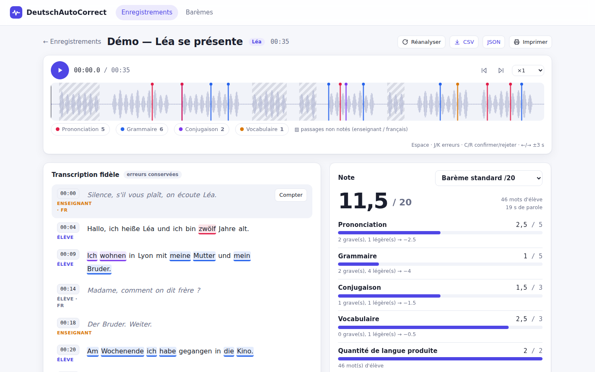

# DeutschAutoCorrect

Correction automatique d'enregistrements oraux d'allemand (collège) : transcription **fidèle** (les erreurs de l'élève sont conservées), détection des erreurs de **grammaire, conjugaison, vocabulaire et prononciation**, timecodes cliquables, et **note automatique** selon un barème paramétrable.



- Mélange allemand / français géré : les passages en français (demande d'aide) et les interventions de l'enseignant (« Silence ! », « Ruhe bitte ») sont détectés, affichés atténués et **exclus de la note** (reclassables en un clic).
- Chaque erreur est confirmable / rejetable / modifiable ; la note se recalcule en direct.
- Barèmes : critères par catégorie (pénalité légère/grave, plafond), quantité de langue (paliers), critères saisis à la main, politique des fautes répétées, arrondi.

Documentation : [`docs/BLUEPRINT.md`](docs/BLUEPRINT.md) (architecture) · [`docs/WORK_PACKAGES.md`](docs/WORK_PACKAGES.md) (découpage et dépendances) · [`CLAUDE.md`](CLAUDE.md) (conventions de dev).

## Démarrage rapide (sans modèle : mode démo)

Prérequis : Python ≥ 3.11, Node ≥ 20, `ffmpeg`.

```bash
make install
make build                              # construit le front (servi par le back)
make demo                               # injecte un enregistrement de démo, lance http://localhost:8000
```

Sans configuration, les moteurs sont factices (`mock`) : l'appli est entièrement utilisable mais la « transcription » est un scénario de démonstration. Pour de vrais enregistrements, activez les moteurs ci-dessous. En développement : `make dev-back` + `make dev-front` (http://localhost:5173).

## Utilisation réelle

```bash
pip install -e "backend[asr,pron]"      # faster-whisper, torch, transformers
sudo apt install espeak-ng ffmpeg       # G2P allemand pour la prononciation
cp .env.example .env                    # puis renseignez ANTHROPIC_API_KEY
# DAC_ASR_BACKEND=faster-whisper  DAC_PRON_BACKEND=wav2vec2  DAC_CORRECTOR_BACKEND=anthropic
```

| Variable | Valeurs | Rôle |
|---|---|---|
| `DAC_ASR_BACKEND` | `faster-whisper` \| `mock` | transcription (GPU recommandé pour `large-v3`) |
| `DAC_PRON_BACKEND` | `wav2vec2` \| `mock` \| `none` | comparaison phonémique (nécessite `espeak-ng`) |
| `DAC_CORRECTOR_BACKEND` | `anthropic` \| `rules` | grammaire / conjugaison / vocabulaire (`rules` = filet hors-ligne limité) |
| `DAC_ANTHROPIC_MODEL` | défaut `claude-opus-5-5` | modèle du correcteur |
| `DAC_DATA_DIR` | défaut `./data` | base SQLite + audio |

Si un moteur configuré est indisponible, l'appli retombe sur le moteur hors-ligne et l'indique (bandeau + `GET /api/health`).

## Comment les erreurs sont conservées et détectées

1. **ASR non « réparateur »** : pas de contexte inter-segments, pas de prompt grammatical, détection de langue par segment, probabilités mot à mot conservées.
2. **Prononciation** : phonèmes attendus (espeak-ng) vs phonèmes réellement prononcés (wav2vec2 CTC), alignés mot à mot avec des coûts adaptés aux francophones (ch-Laut, ü/ö, h, w/v, z, ei/ie, durcissement final…). Les mots reconnus avec une faible confiance sont signalés « à vérifier » et **ne comptent dans la note qu'une fois confirmés**.
3. **Grammaire / conjugaison / vocabulaire** : Claude en sortie JSON structurée sur le transcript annoté ; filet de règles hors-ligne.

## Tests

```bash
make test        # pytest (backend) + vitest (frontend)
make lint
# test de bout en bout + captures (backend démo lancé) :
cd frontend && BASE=http://localhost:8000 node e2e/smoke.mjs
```

## Limites connues

- Les moteurs réels (Whisper, wav2vec2, Claude) n'ont pas été exécutés dans l'environnement de développement initial (pas de GPU/modèles/clé) : leurs adaptateurs sont testés via interfaces et doubles ; une recette sur de vrais enregistrements d'élèves est la prochaine étape.
- La qualité de la prononciation dépend du reconnaisseur de phonèmes (bruit de classe, voix d'enfants) : traitez-la comme une aide à l'écoute, d'où le workflow confirmer / rejeter.
- Un seul fichier = un élève principal. Pas d'identification vocale multi-élèves ni d'authentification (v1).
- Le moteur de règles hors-ligne ne couvre qu'un petit ensemble de fautes très fréquentes.
