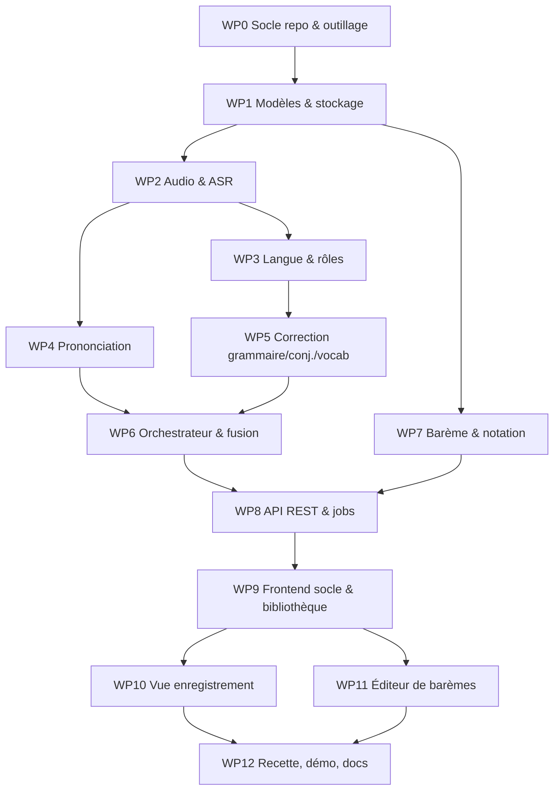

# Work packages & dépendances

Légende : `Dép.` = work packages à terminer avant. Chaque WP a des **critères d'acceptation** vérifiables.
Statut : ✅ livré dans ce dépôt.

Parallélisable : {WP2, WP7} ; {WP3, WP4} ; {WP10, WP11}.

| WP | Intitulé | Dép. | Contenu | Acceptation | Statut |
|----|----------|------|---------|-------------|--------|
| WP0 | Socle | — | arborescence, `pyproject`, `package.json`, Makefile, `.gitignore`, `CLAUDE.md`, docs | `make test` lance back+front | ✅ |
| WP1 | Modèles & stockage | WP0 | modèles pydantic, config, SQLite, repository | CRUD enregistrements/barèmes testé | ✅ |
| WP2 | Audio & ASR | WP1 | normalisation ffmpeg, durée, pics ; `AsrEngine` : faster-whisper + mock | wav 16 kHz produit ; mock renvoie segments avec mots/probas | ✅ |
| WP3 | Langue & rôles | WP2 | détecteur de langue lexical, classifieur de rôle (injonctions FR/DE, locuteur dominant) | « Ruhe bitte » / « Silence ! » → teacher ; phrase FR → `fr` non notée | ✅ |
| WP4 | Prononciation | WP2 | G2P espeak-ng, reconnaisseur phonèmes wav2vec2, **comparateur pondéré** (pur), signal faible confiance | tests : ich→[ɪç] prononcé [ɪk] détecté « ch-Laut » ; identique → 0 erreur | ✅ |
| WP5 | Correction | WP3 | `Corrector` Anthropic (JSON structuré) + règles hors-ligne | JSON invalide toléré ; règles détectent « ich bist », « ich habe gegangen », mots FR | ✅ |
| WP6 | Orchestrateur | WP4, WP5 | enchaînement, progression, dédoublonnage, ancrage temporel, gestion d'échec par étape | pipeline mock bout-en-bout ; une étape optionnelle en échec ne casse pas le job | ✅ |
| WP7 | Barème & notation | WP1 | schéma barème, moteur pur, barème par défaut, politique de répétition | tests cas limites (plancher 0, plafonds, répétitions, volume, manuel, arrondi) | ✅ |
| WP8 | API & jobs | WP6, WP7 | routes, upload, JobRunner, Range audio, export | TestClient : upload → done → patch erreur → note change | ✅ |
| WP9 | Front socle | WP8 | Vite+React+TS, client API, design system, bibliothèque/upload | build OK, page liste fonctionnelle | ✅ |
| WP10 | Vue enregistrement | WP9 | lecteur, forme d'onde + marqueurs, transcript, erreurs groupées + timecodes cliquables, édition, note live | clic sur timecode → `audio.currentTime` ; rejet d'erreur → note change | ✅ |
| WP11 | Éditeur de barèmes | WP9 | CRUD barèmes, aperçu live, import/export | création/édition persistées | ✅ |
| WP12 | Recette | WP10, WP11 | jeu de démo, script de démo, captures Playwright, README | parcours complet sur démo sans modèle | ✅ |

## Ordre d'exécution retenu

WP0 → WP1 → (WP7 ∥ WP2) → (WP3 ∥ WP4) → WP5 → WP6 → WP8 → WP9 → (WP10 ∥ WP11) → WP12.
